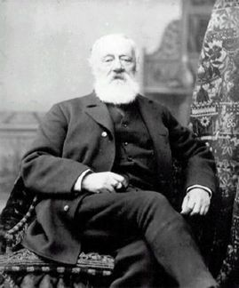

# teletrófono



A library written in clojure to write scenarios testing the the
Session Initiation Protocol (SIP) of a Back-to-Back User Agent
(B2BUA).

The name of this project is inspired by Antonio Meucci who called his
invention of an early voice communicating device "teletrofono". For more information
see the
article
[Invention of the telephone](https://en.wikipedia.org/wiki/Invention_of_the_telephone) on
wikipedia.org.

## Usage

Clone the project.

``` shell
git clone git@github.com/bevuta/teletrofono.git
```

Configure your testing environment. You can make a copy of the example
file and edit it:

``` shell
cp config.example.clj config.clj
```

The file `config.example.clj` contains all configuration options with
documentation as code comments. Please look there for a explanation of
the options.

You can now run leiningen with the unit-test namespace and pipe stderr
and stdout into seperate files.

``` shell
time lein test teletrofono.unit-test 2> stderr.log > stdout.log
```

Or you can run the performance test you have just configured in `config.clj`.

``` shell
time lein test teletrofono.performance-test 2> stderr.log > stdout.log
```

After that you find a summary of the assertions and perhaps some
exception-reports in `stdout.log`. Debugging information of received
SIP-events will also be logged into `stdout.log` unless you configure
`src/log4j.properties` to do otherwise. `stderr.log` contains logging
outputs from the java-dependency `com.bevuta/mjsip-fork` with more
details, which can be a lot depending on the test duration. The `time`
command measures the duration of the test.

### Unit-tests

The unit tests are gathered in the appropriate testing namespace
`teletrofono.unit-test`. There is an own test-function for every test
scenario and its variations.

### Performance-tests

Actually it is just one test function testing all predefined scenarios
and their variations. In the namespace `teletrofono.performance-test`
you can find the logic for the whole performance test provided by the
function `run-scenarios-longterm`. The docstring of this function
describes the procedure in detail.

## Customization

You are free to fork this project to implement your own testing
scenarios suiting the enironment you are working on.

In the namespace `teletrofono.test-scenarios` you can find a set of
predefined scenario functions. The scenarios are described in the
docstrings of the functions. All these scenarios are used by
`teletrofono.unit-test` and `teletrofono.performance-test`. There you
can find analogous fixtures which prepare the SIP-clients used by the
scenario functions.

Here is a simple example of such a scenario function:

``` clojure
(defn simple-conversation
  "Simulates a simple conversation between two SIP-clients called
  watson and bell. Variations:
  :long - Conversation of one minute length.
  :short - Conversation of fife seconds length."
  [variation watson bell]
  (let [;; Watson invites bell for a call resulting in a not yet
        ;; accepted outgoing call. The outgoing call is associeted
        ;; with watson as the caller.
        outgoing-call (invite watson bell)
        ;; Bell waits for the invitation identified by the given
        ;; outgoing call which results in a incoming call as soon as
        ;; the invitation was received. The call is not yet
        ;; accepted. The incoming call is associated with Bell as the
        ;; callee.
        incoming-call (await-call! bell outgoing-call)]
    ;; Bell responds with a Ringing-Signal using the incoming call as
    ;; the origin and the outgoing call as the receiver of the signal.
    (ring! incoming-call outgoing-call)
    ;; Now Bell accepts the call by signaling a confirmation from the
    ;; incoming call to the outgoing call.
    (accept! incoming-call outgoing-call)
    ;; Some time elapses during the conversation.
    (case variation
      :long (Thread/sleep 60000)
      :short (Thread/sleep 5000))
    ;; Watson finishes the conversation by signaling a hangup from the
    ;; outgoing call to the incoming call.
    (hangup! outgoing-call incoming-call)))
```

As soon as something unexpected happens an exception will be thrown by
one of the core functions. Otherwise the scenario function should
return `nil`.

You can for example first add the scenario above to the
`teletrofono.test-scenarios` namespace and then write the appropriate
unit-test function in the `teletrofono.unit-test` namespace:

``` clojure
(deftest simple-conversation_short
  ;; Run the variation :short with client a as watson and client b as bell.
  (run-scenario simple-conversation :short *client-a* *client-b*))
```

The name for this test function is the name of the scenario function
followed by a underscore and the variation name. You find this naming
pattern also in the unit tests.

The configuration and the SIP-clients are initialized in the fixture,
so you can try your scenario by simply running this test function or
test the whole namespace which runs all unit-tests in the order they
appear in the file.

## License

Copyright © 2017 FIXME

Distributed under the Eclipse Public License either version 1.0 or (at
your option) any later version.
